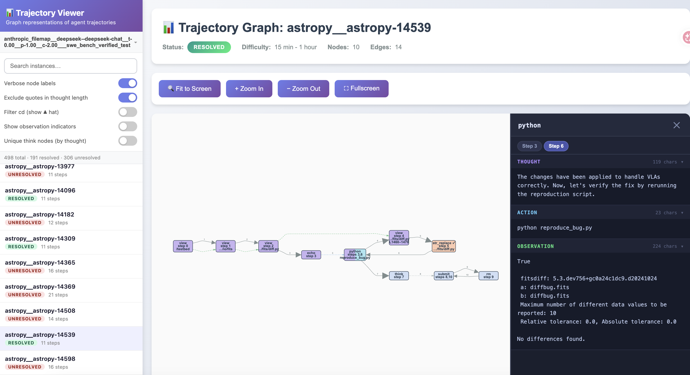

# Graph Construction

The **live server** interactively visualises SWE-agent, OpenHands, mini-swe-agent, Claude Code, and Codex trajectories on demand in the browser. The existing **batch export script** pre-generates graph JSON files for the benchmark-oriented formats documented below.

---

## Live Server

`live_graph_server.py` starts a local HTTP server and renders every trajectory as an interactive graph on demand. Nothing is written to disk. The agent type is detected automatically from the path you pass.

### Quick Start

**SWE-agent** — pass the directory that contains your `.traj` files:

```bash
python live_graph_server.py \
    --trajs path/to/trajectories \
    --eval_report path/to/report.json
```

**OpenHands** — pass the `output.jsonl` file directly:

```bash
python live_graph_server.py \
    --trajs path/to/output.jsonl \
    --eval_report path/to/report.json
```

**Claude Code** - pass a compatible session root whose `state.json` records `custom.sourceFramework: "Claude Code"`. This preserves the Claude Code framework label even when a different model generated the trajectory. Shell executables are normalized by basename, so commands such as `/opt/venv/bin/pytest`, `/opt/venv/bin/mypy`, `black --check`, and `isort --check` are classified as localization before a source edit and validation after one:

```bash
python graph_construction/live_graph_server.py \
    --trajs path/to/claude-code-sessions
```

**Codex** - pass the Codex session root or one persisted `rollout-*.jsonl` file. An evaluation report is optional:

```bash
python graph_construction/live_graph_server.py \
    --trajs ~/.codex/sessions
```

In Windows PowerShell, use `$HOME\.codex\sessions`; in Command Prompt, use `%USERPROFILE%\.codex\sessions`. Graphectory recursively discovers rollout files, pairs tool calls with outputs by call ID, expands shell and `apply_patch` activity, and retains final responses. Codex does not persist private chain-of-thought in these logs, so the viewer's thought field contains only visible assistant commentary and any explicitly surfaced reasoning summaries.

Then open **http://localhost:8000** in your browser.

When Docker is used, expose the port when starting the container, for example:

```bash
docker run -it -p 8000:8000 graphectory bash
```

Then run the server inside the container.


*Live server interface showing instance list (left) and interactive graph visualization (right) with phase-colored nodes.*

### Arguments

| Argument | Required | Default | Description |
|---|---|---|---|
| `--trajs` | ✓ | — | Supported trajectory directory or JSONL file. Compatible Claude Code sessions use a session root; Codex accepts `~/.codex/sessions` or one rollout JSONL file. |
| `--eval_report` | | — | Optional SWE-bench evaluation report JSON containing `"resolved_ids"` and `"unresolved_ids"` arrays. |
| `--assets_dir` | | script directory | Directory containing `graph_template.html`, `styles.css`, and `graph_renderer.js`. Only needed if you have moved those files elsewhere. |
| `--port` | | `8000` | Port to serve on. |

### The Browser UI

The left sidebar lists every trajectory found in the provided path. Each entry shows the instance ID, a coloured status badge (resolved / unresolved / unsubmitted), and a step count. The search box filters the list in real time by instance ID substring. The collapsible **Data source** section accepts manually entered paths and, when the server runs on a local desktop, native file and folder pickers.

Clicking an entry loads its graph into the main canvas. The graph is rendered inside a sandboxed iframe; switching instances swaps the content without reloading the page. Its floating question-mark control opens the phase and edge legend.

#### View Toggles

Four toggles sit inside the expandable gear menu at the top right of the graph canvas. Changing any of them immediately re-requests the current graph with the new settings applied.

| Toggle | Default | Effect |
|---|---|---|
| **Exclude quotes in thought length** | On | Strips content inside backticks and quote characters before measuring thought length, so arrowhead sizes reflect genuine reasoning rather than copied code. |
| **Filter cd (show ▲ hat)** | Off | Strips leading `cd` commands from multi-command steps and replaces them with a small orange triangle (▲) on the node. |
| **Show observation indicators** | Off | Draws a small coloured square on each edge at the 25% point, encoding the length and success/failure outcome of the previous step's tool response. |
| **Unique think nodes (by thought)** | Off | When on, each `think` step with distinct thought text becomes its own node rather than all think steps collapsing into one. Two steps with identical thought text still share a node. |

#### Reading the Graph

Nodes are coloured by **phase**:

| Colour | Phase | Meaning |
|---|---|---|
| Purple | Localization | Reading files, searching code, running tests before any patch |
| Orange | Patch | Creating or editing source files |
| Blue | Validation | Running tests, static analysis, or formatter checks after a patch exists |
| Light blue | General | Everything else (think steps, navigation, etc.) |

A node can show two colours as a horizontal gradient when the same action was visited in multiple phases across repeated steps.

Edges are styled by **type**:

| Style | Meaning |
|---|---|
| Grey solid, scaled arrowhead | Normal execution. Arrowhead size encodes thought length; larger arrowheads indicate longer reasoning text on that transition. |
| Red solid | Thought continuation — the model's thought for this step was identical to or a prefix of the previous step's, indicating cached reasoning. |
| Blue dashed | Intra-step — connects sub-actions within a single `&&`-chained step. |
| Green dashed | Hierarchy — drawn between `str_replace_editor view` nodes when one path is a subdirectory or line-range subset of another. |

Click any node to open a detail sidebar showing the full thought, action, and observation text for that node. If the node was visited multiple times, tab buttons let you page through each visit. The sidebar's left edge is draggable to resize it.

---

## Batch JSON Export (`generatejson.py`)

`generatejson.py` processes a batch of trajectories and writes one graph JSON file per instance. This is useful for archiving graphs, diffing runs offline, or loading graphs into other tools.

### Quick Start

**SWE-agent with DeepSeek-V3:**
```bash
python graph_construction/generatejson.py \
  --agent sa --model dsk-v3 \
  --trajs data/samples/SWE-agent/trajectories/anthropic_filemap__deepseek--deepseek-chat__t-0.00__p-1.00__c-2.00___swe_bench_verified_test \
  --eval_report data/SWE-agent/reports/deepseek-chat.json \
  --output_dir data/samples
```

**OpenHands with Claude-Sonnet-4:**
```bash
python graph_construction/generatejson.py \
  --agent oh --model cld-4 \
  --trajs data/samples/OpenHands/trajectories/deepseek-chat_maxiter_100_N_v0.40.0-no-hint-run_1/sample_output.jsonl \
  --eval_report data/samples/OpenHands/trajectories/deepseek-chat_maxiter_100_N_v0.40.0-no-hint-run_1/report.json \
  --output_dir data/samples
```

**mini-swe-agent with gpt-5-mini:**
```bash
python graph_construction/generatejson.py \
  --agent msa --model gpt-5-mini \
  --trajs data/samples/mini-swe-agent/trajectories/gpt-5-mini \
  --eval_report data/samples/mini-swe-agent/reports/gpt-5-mini.json \
  --output_dir data/samples
```

**Output**: `{output_dir}/{Agent}/graphs/{model}/{instance_id}/{instance_id}.json`

### Arguments

| Argument | Required | Default | Description |
|---|---|---|---|
| `--agent` | ✓ | — | Agent type: `sa` (SWE-agent) or `oh` (OpenHands). |
| `--model` | ✓ | — | Model shorthand — controls the output subdirectory name. See table below. |
| `--trajs` | ✓ | — | Directory of `.traj` files (SA) or path to `output.jsonl` (OH). |
| `--eval_report` | ✓ | — | SWE-bench evaluation report JSON. |
| `--output_dir` | ✓ | — | Root output directory. Graphs are written under `{output_dir}/{Agent}/graphs/{model}/`. |
| `--workers` | | `8` | Number of parallel worker processes. |

#### Model Shorthands

| Flag | Full name written to disk |
|---|---|
| `dsk-v3` | `deepseek-v3` |
| `dsk-r1` | `deepseek-r1-0528` |
| `dev` | `devstral-small` |
| `cld-4` | `claude-sonnet-4` |

### Output Structure

```
output/
├── SWE-agent/
│   └── graphs/
│       └── deepseek-v3/
│           └── django__django-12345/
│               └── django__django-12345.json
└── OpenHands/
    └── graphs/
        └── claude-sonnet-4/
            └── django__django-12345/
                └── django__django-12345.json
```

Each JSON file is a NetworkX node-link graph. Nodes carry label, phase, step indices, thought lengths, tool/command metadata, and the full thought/action/observation text for every visit. Edges carry type (`exec`, `hier`), step index, and thought length.

---

## How Graphs Are Built

Both `generatejson.py` and `live_graph_server.py` share the same graph construction pipeline:

1. **Parsing**: Agent trajectories → atomic actions using [commandParser.py](commandParser.py)
2. **Node Deduplication**: Identical actions merged with occurrence tracking
3. **Phase Classification**: Actions categorized using heuristics ([mapPhase.py](mapPhase.py)):
   - **Localization**: Information gathering, searching, test generation before patching
   - **Patch**: Creating/editing non-test files
   - **Validation**: Running tests, static analysis, formatter checks, or editing test files after patching
   - **General**: Other actions (planning, environment setup)
4. **Edge Construction**: Temporal edges (sequential execution flow) + structural edges (hierarchical relationship in the code base) + Thought continuation (If the current step's thought is identical to or a prefix of the previous step's thought, the connecting edge is flagged as a thought continuation and drawn in red, making it easy to spot steps where the model reused cached reasoning.)
5. **Output**:
   - `generatejson.py`: JSON files (NetworkX node-link format)
   - `live_graph_server.py`: Interactive HTML visualization with phase-colored nodes

**Graph Metadata**: Each graph includes `resolution_status`, `instance_name`, and `debug_difficulty`

For detailed graph construction details, see [buildGraph.py](buildGraph.py).

---

## Extending Graphectory

### Adding New Models

The four models (`dsk-v3`, `dsk-r1`, `dev`, `cld-4`) are pre-configured for paper reproducibility. To add new models, edit [generatejson.py:38](generatejson.py#L38):

```python
SUPPORTED_MODELS = {"dsk-v3", "dsk-r1", "dev", "cld-4", "my-model"}
```

Then run with your new model:
```bash
python graph_construction/generatejson.py \
  --agent sa --model my-model \
  --trajs <your_trajectories> \
  --eval_report <your_report> \
  --output_dir <output>
```

### Supporting New SWE-agent Tools

To parse custom SWE-agent tools, add their `config.yaml` files to [generatejson.py:222-234](generatejson.py#L222-L234):

```python
def setup_parser_for_agent(agent: str) -> CommandParser:
    parser = CommandParser()
    tool_configs = []
    if agent == "sa":
        tool_configs = [
            "data/SWE-agent/tools/edit_anthropic/config.yaml",
            "data/SWE-agent/tools/review_on_submit_m/config.yaml",
            "data/SWE-agent/tools/registry/config.yaml",
            "data/SWE-agent/tools/your_custom_tool/config.yaml",  # Add here
        ]
    if tool_configs:
        parser.load_tool_yaml_files(tool_configs)
    return parser
```

### Supporting New Agents

To add support for a new agent framework:

1. **Implement trajectory builder** in [buildGraph.py](buildGraph.py) (see existing functions at lines 274 & 365):
   ```python
    def build_graph_from_newagent_trajectory(traj_data, parser, instance_id, output_dir, eval_report_path):
        builder = GraphBuilder()
        # Parse agent-specific trajectory structure
        # Convert to builder.add_or_update_node() calls
        return builder.finalize_and_save(output_dir, instance_id, eval_report_path)
   ```

2. **Register the agent** in [generatejson.py:37-50](generatejson.py#L37-L50):
   - Update `SUPPORTED_AGENTS` and `AGENT_NAMES`

3. **Add trajectory loading logic** in [generatejson.py](generatejson.py):
   - Update `load_trajectories()` to handle NewAgent's file format
   - Add branch in `GraphProcessor.process_trajectory()` to call your builder function

**Key principle**: Different agents have different trajectory formats, but all generate the same unified graph structure (nodes with phases, execution/hierarchical edges, metadata).

---
